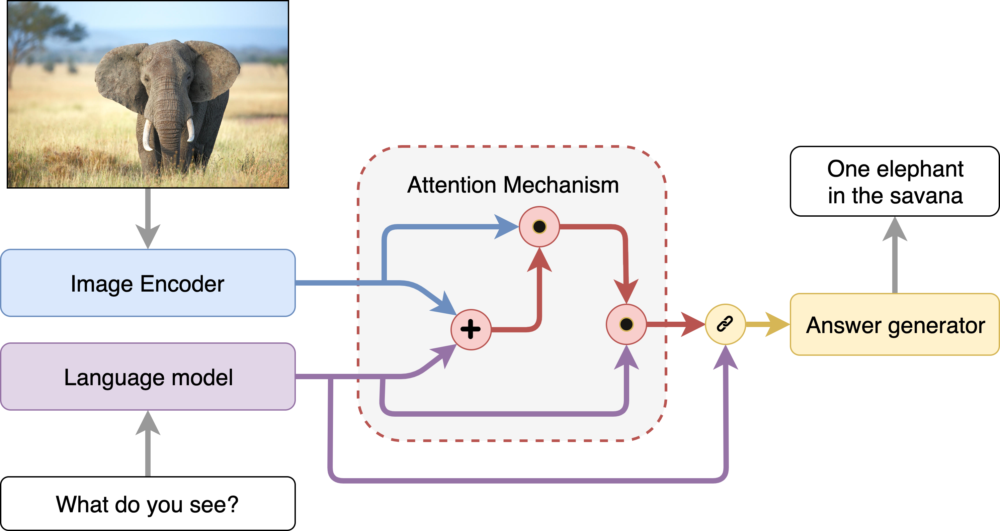
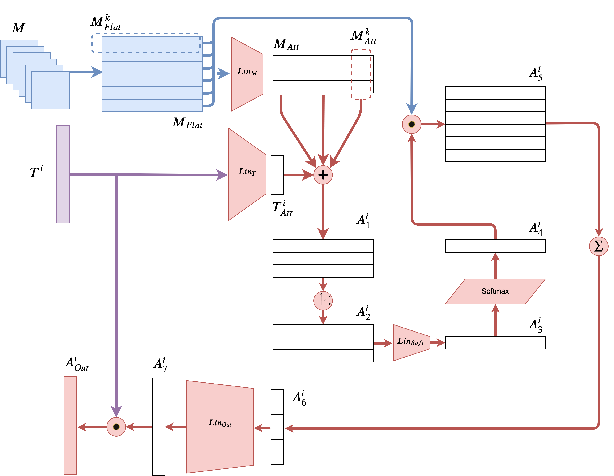
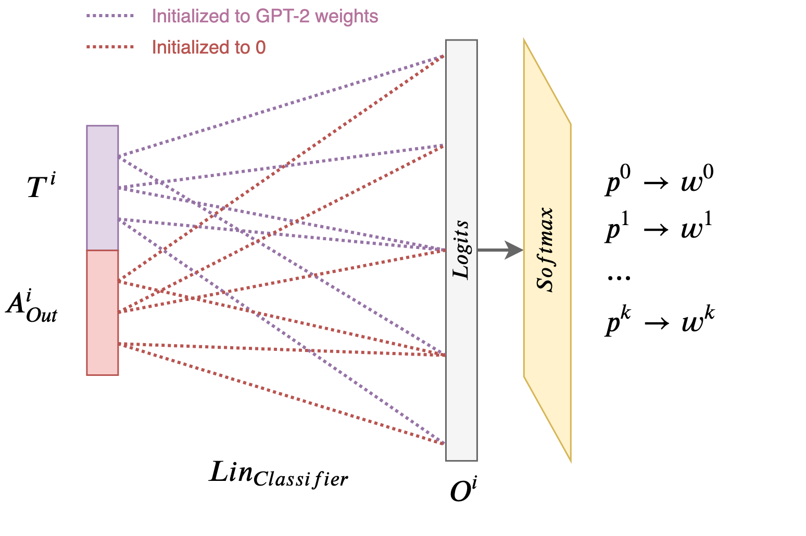
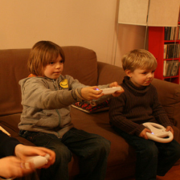
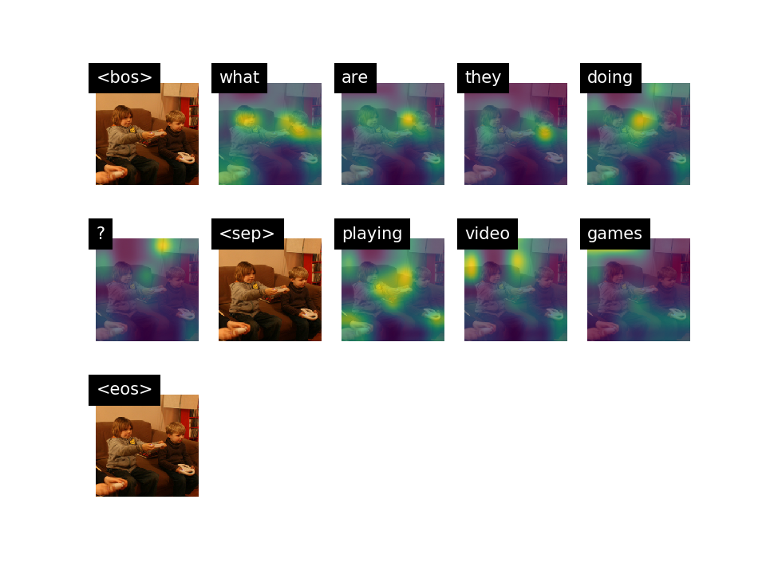
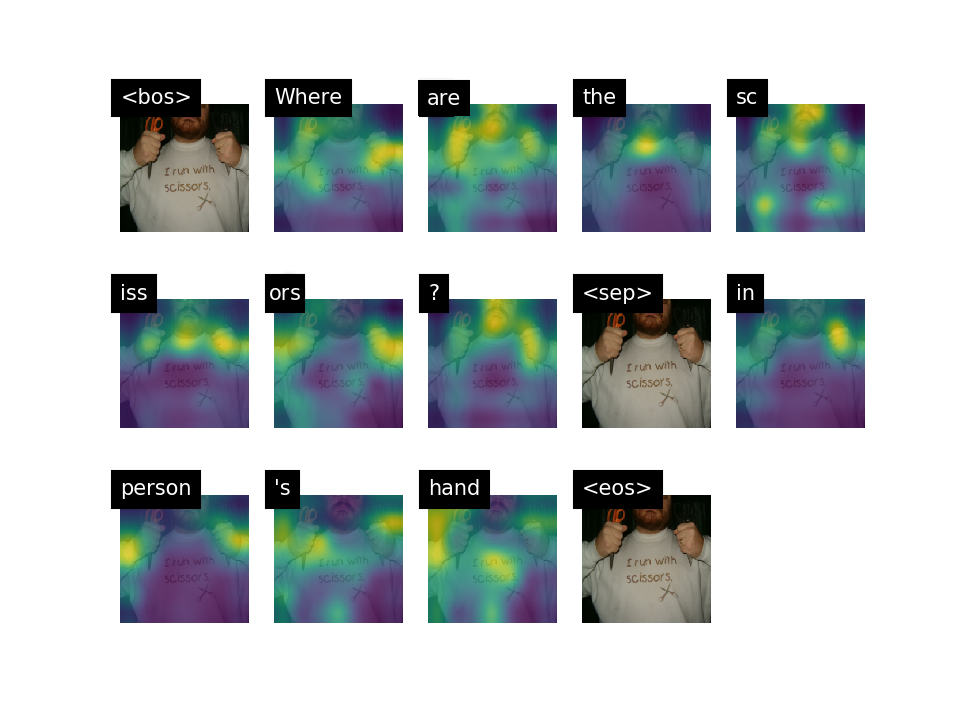

# Transformer-VQA

#### Overview

This repository contains the implementation of a Transformer-based VQA architecture.

> Disclaimer: this project was developed as a **Masters thesis** (*Towards Open-Ended VQA Models using Transformers*) for the **University of Illinois at Chicago** and **Politecnico di Milano** by me, Alberto Mario Bellini, with the help of my advisors prof. Matteo Matteucci, prof. Mark James Carman and prof. Natalie Parde.

Most VQA systems usually address the task as if it was classification; this works tries to overcome this limitation by exploiting the power of language models such as GPT-2 to generate answers in an autoregressive fashion. 

More specifically, we employ **OpenAI's GPT-2** small (117M) and combine it with **VGGNet-11** to extract features from both the question and the image. Afterwards, using a CoAttention Mechanism we bring the two modalities down into a common subsbace where a higher level representaion is computed. Finally, we concatenate the attention output back with GPT-2 hidden states and connect back the Transformer head over the vocabulary of words.

Using Beam-Search we generate our answers one word at a time, effectively exploiting the pre-trained information contained within the language model. However, the generation of each word is conditioned even on the attention block.

#### Architecture

- **Image encoder** : VGGNet-11 (pre-trained - dropped final FC and kept only 512, 7x7 maps).
- **Question encoder**: GPT-2 small (pre-trained - dropped head, kept only 768-dim hiddens).
- **Attention mechanism**: Custom (question-to-image & image-to-question attention).
- **Final classifier**: FC over 50K words, ad-hoc weight initialization. 

##### Overall architecture

##### Attention mechanism in detail (for a single token in the question)

##### How we combine the attention output with gpt-2 hidden states.

#### Evaluation

We **evaluate our results** with three metrics:
- Accuracy (penalizes open-ended answers but is usually reported in most VQA papers)
- BLEU (with varying n-gram modified precision weights)
- Word Mover's Distance (with pre-trained 100-dim GloVe embeddings)

We are currently trying to evaluate our results even with:
- METEOR
- WUPS

We compare our architecture against **4 baselines**:
- GPT-2 QA-Only baseline
- BERT QA-Only baseline
- Captioning IA-Only baseline
- Strong VQA baseline

#### Discussion

This work is not over. We are currently trying toi reduce the size of the architecture (202M params) and we intend to experiment with different image encoders (such as ResNet). Furthermore, we aim at implementing a multi-head attention mechanism. 

We are currently writing a paper for **IJCAI 2020** and **ACL2020** and hope to be accepted.

#### Web Demo

Even though we developed an online interactive demo, we don't have any public VM with a static IP nor any domain to make it accessible world-wide. Sorry, we'll try our best to make it public ASAP but the costs are not neglegible. Thank you.

#### Qualitative results

